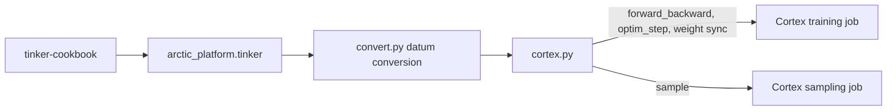
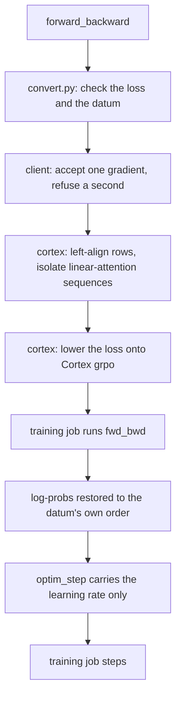

# Tinker integration

Cookbook recipes run on Cortex by importing `arctic_platform.tinker` in place
of `tinker`. That import registers itself as `sys.modules["tinker"]`, so the
recipe's existing `import tinker` lines use Cortex. There is no local Tinker
server and no `TINKER_BASE_URL`.

GPU counts are arguments on the launcher, the same ones the Cortex client CLI
takes (`--training-gpus`, `--sampling-gpus`). Connection settings stay in
`ARCTIC_CORTEX_*`.

`python -m tinker_cookbook...` never runs a user import first, so start the
recipe through `python -m arctic_platform.tinker.run`. A script you own can
instead put `from arctic_platform import tinker` on its first line and
construct `tinker.ServiceClient(training_gpus=..., sampling_gpus=...)`.

Validated with `tinker==0.25.0` and `tinker-cookbook==0.5.5`.

## Request path

`arctic_platform.tinker` is the client a recipe imports. It calls three modules
in `arctic_platform.integrations.tinker`: `convert.py` turns datums and sampling
params into batch fields, `job.py` builds the Cortex job, and `cortex.py` runs
that job. Only `cortex.py` imports Cortex.



`forward` is not implemented. A second `forward_backward` before `optim_step` is refused, because Cortex keeps only the latest gradient.

One optimizer step:



Sampling and distillation take the other jobs. `sample` is checked for temperature 1.0, then generated on the sampling job. `create_sampling_client(base_model=...)` opens a second sampling job on that model's base weights. `compute_logprobs` reads its prompt log-probs and does not generate.

## Install

```bash
pip install "arctic_platform[tinker]"
pip install "tinker==0.25.0" "tinker-cookbook[math-rl]==0.5.5"
```

The recipe process is CPU-only. Cortex runs the training and sampling workers.

## Configure Cortex

```bash
export ARCTIC_CORTEX_HOST=<account>.<region>.snowflakecomputing.com
export ARCTIC_CORTEX_DATABASE=<db>
export ARCTIC_CORTEX_SCHEMA=<schema>
export ARCTIC_CORTEX_PAT=<your PAT>
```

The account needs:

- an existing database and schema
- a Snowflake PAT
- quota for both the training and sampling sub-jobs

A job can remain in `PLACING` while it waits for GPU capacity.

## Run a cookbook recipe

```bash
python -m arctic_platform.tinker.run \
    --training-gpus 1 \
    --sampling-gpus 1 \
    --max-prompt-length 4096 \
    --max-response-length 1024 \
    tinker_cookbook.recipes.math_rl.train \
    env=gsm8k \
    model_name=Qwen/Qwen3.5-4B \
    group_size=64 \
    groups_per_batch=32 \
    learning_rate=8e-5 \
    max_tokens=1024
```

`base_url` on the recipe is ignored. The process releases the Cortex job on
exit.

A handwritten script:

```python
from arctic_platform import tinker

service = tinker.ServiceClient(training_gpus=1, sampling_gpus=1)
training = await service.create_lora_training_client_async("Qwen/Qwen3-0.6B", rank=32)
```

Required settings:

- Set `renderer_name` explicitly for models absent from the cookbook's
  recommendation table.
- `lora_rank` on the recipe is the LoRA rank provisioned on the Cortex job.
- Use `temperature=1.0`.
- Keep `max_tokens` within `--max-response-length`.
- Ensure rendered prompts fit `--max-prompt-length`.
- Sampler saves sync weights for this process. Resume from a new process is refused.

Training rows are never truncated. A prompt or response longer than its limit
is accepted as long as the whole datum fits
`--max-prompt-length + --max-response-length`; a longer datum is refused.

### LoRA and the optimizer

The adapter and the optimizer are part of the Cortex job, so
`create_lora_training_client_async` fixes them when the job is created:

- `rank=N` trains a LoRA adapter of rank `N` with alpha `32` (Tinker's) on
  `mlp,attn,unembed` (Tinker's `train_mlp`, `train_attn`, and `train_unembed`).
  Weight sync sends only the adapter. Rank `0` is full fine-tuning.
- Adam uses `--adam-beta1 0.9 --adam-beta2 0.95 --adam-eps 1e-8
  --weight-decay 0 --grad-clip-norm 0`, the values the cookbook sends.

Adam betas, eps, weight decay, and grad clip are fixed when the job is created.
Each `optim_step` sends only the learning rate.

The cookbook's default learning rate is intended for LoRA. Full fine-tuning
may require a lower learning rate.

## Supported scope

Supported:

- text-only full fine-tuning and LoRA
- `ppo`, `importance_sampling`, and `cross_entropy`, with the importance
  ratio taken against the sampler's log-probs; `ppo` accepts
  `clip_low_threshold` and `clip_high_threshold` in `loss_fn_config`
- sampling, forward-backward, optimizer step, and sampler weight sync
- on-policy distillation from one teacher, including `compute_logprobs`

Current limitations. The client raises `RuntimeError` for a refusal. A Cortex rejection comes back as the underlying request error.

| Limitation | Behavior |
|---|---|
| LoRA | One rank and module set, fixed when the job is created. |
| Temperature | Temperatures other than `1.0` are refused. |
| Checkpoints | A sampler save syncs weights. Only the path just saved can be opened, and only in this process. Resume raises. |
| Sequence limits | A datum longer than `--max-prompt-length + --max-response-length` is refused. |
| Loss config | `loss_fn_config` keys other than PPO's two clip thresholds are refused. |
| Forward | `forward` is refused. `forward_backward` returns the log-probs. NLL eval uses `forward`, so set `eval_every=0` for `chat_sl`. Custom losses (DPO, SDFT) call `forward` first and are unavailable. |
| Gradient accumulation | A second `forward_backward` before `optim_step` is refused. Cortex keeps only the latest gradient. Leave `stream_minibatch_config` unset or use `num_minibatches=1`. |
| Teacher | `base_model` opens that model's base weights, including the student. Prompt cap is student prompt + response. Response cap matches the student. `model_path` is refused. |
| Optimizer overrides | Only the learning rate varies per step; other Adam settings are fixed at start-up. |
| Multimodal input | Only encoded text tokens are passed to Cortex. |
| Authentication | Uses `ARCTIC_CORTEX_*`. `base_url` is ignored. |

Recipes that require audio, images, checkpoint resume, reference-model
workers, external tools, or external graders are not covered by this
integration.

## Tensor layout

`cortex.py` handles three tensor conventions:

- Tinker rows contain left prompt padding; Cortex expects valid tokens in
  leading columns. The Cortex binder aligns rows before the request and restores
  the original order in returned log-probs.
- The final `target_tokens` item is appended as a scoring token. It is excluded
  from the response mask and advantages.
- Cortex refuses a batch with fewer rows than training GPUs. Short batches are
  padded with copies of a row that carry no loss, and the copies are dropped
  from the returned log-probs.

Cortex packs several sequences into one micro-batch. Models with linear
  attention layers (Qwen3.5's Gated DeltaNet) carry state across sequence
  boundaries in Cortex's Hugging Face provider, which corrupts every sequence
  after the first in a pack. For these models (`--isolate-sequences auto`, the
  default) the job provisions micro-batches of one full-length datum and
  extends each row with loss-free tokens past half that length, so no two rows
  share a micro-batch. This costs throughput on short rows. Remove it once
  Cortex resets linear-attention state at packed boundaries.

## Validation

Live validation covered `math_rl`, `chat_sl`, and `rl_loop` with importance
sampling, PPO, and cross-entropy. Detailed results are recorded in the PR.

Trainer parity with Tinker was measured by sampling rollouts on Tinker once and
replaying the same datums on Tinker and on this adapter for five steps, both
training the same LoRA with the cookbook's Adam settings. The convergence
recipes were re-run for ten steps against runs made before the packing,
chunking, and resend fixes:

| Recipe | Model | Setup | Result |
|---|---|---|---|
| `math_rl` GSM8K, parity | Qwen3.5-4B | LoRA rank 32, lr `1e-5`, 5 steps, same datums on both | Loss `0.01025 → 0.00889` (Tinker) and `0.01029 → 0.00891` (Cortex); per-token log-prob gap `0.004` |
| On-policy distillation, parity | Qwen3.5-4B, teacher Qwen3.5-9B | LoRA rank 128, lr `1e-4`, 5 steps, same datums on both | Loss `0.0733 → -0.3395` (Tinker) and `0.0728 → -0.3517` (Cortex); teacher log-prob gap `0.0096` |
| On-policy distillation, parity | Qwen3.5-4B, teacher Qwen3.6-35B-A3B | LoRA rank 32, lr `1e-4`, 16 rollouts, 4,096 tokens, 5 steps, same datums on both. Both models are in the Cortex training catalog. The teacher scored the sample on Tinker | Loss `0.211 → -2.973` (Tinker) and `0.211 → -3.095` (Cortex); per-token log-prob gap `0.018`; drift `-0.241` / `-0.238` |
| On-policy distillation, GSM8K | Qwen3.5-4B, teacher Qwen3.6-35B-A3B | LoRA rank 32, lr `1e-4`, 16 rollouts, 3,915 tokens, 5 steps | Tinker loss `0.132 → -0.158`. Cortex did not train: the 1-GPU job failed `placement_timeout` twice |
| On-policy distillation, MATH | Qwen3.5-4B, teacher Qwen3.6-35B-A3B | LoRA rank 32, lr `1e-4`, 16 rollouts, 4,096 tokens, 5 steps | Tinker loss `0.165 → -0.714`. Cortex did not train: same `placement_timeout` |
| `math_rl` GSM8K, convergence | Qwen3.5-9B | Full fine-tuning, lr `2e-6`, 64 groups of 8, 10 steps | Accuracy at step 9 `0.926` before the fixes, `0.951` after; `kl_sample_train_v1` `0.023`–`0.040` before, `0.0001`–`0.0003` after |
| `math_rl` MATH, convergence | Qwen3.5-9B | Full fine-tuning, lr `1e-6`, 64 groups of 16, 10 steps | Accuracy at step 9 `0.098` before the fixes, `0.307` after; `kl_sample_train_v1` about `0.019` before, `0.0002` after |

Keeping one sequence per micro-batch on Qwen3.5 makes a step slower: about
125 s instead of 75 s for GSM8K, and 252 s instead of 100 s for MATH.

For RL runs, `kl_sample_train_v1` checks agreement between sampler and trainer
log-probs. In the parity runs it started at `0.0002`–`0.0004` on both
backends. A value far above that from the first step, or one that keeps
rising without learning, points to a request-shape, alignment, or packing
problem.

## Tests

```bash
pip install -e ".[testing]"
pytest -q tests/integrations/tinker
```

The tests cover datum packing, Cortex lowering, row alignment, and error
handling. They do not require a Cortex account or GPU.

## Troubleshooting

| Error | Action |
|---|---|
| `KeyError` from `get_recommended_renderer_name` | Pass `renderer_name` explicitly. |
| `cortex ... returned no per-token log-probs` | Check the Cortex response shape and configured post-processor. |
| `packing requires left-aligned rows` | Confirm the batch went through `cortex.py`. |
| Job remains in `PLACING` | Check account GPU capacity and quota. |
| `429 ... GPU cap reached` | Release an existing job and retry after cancellation completes. |

## Files

| File | Role |
|---|---|
| `arctic_platform/tinker/__init__.py` | `ServiceClient`, `TrainingClient`, `SamplingClient` |
| `arctic_platform/tinker/run.py` | `python -m arctic_platform.tinker.run` |
| `arctic_platform/integrations/tinker/convert.py` | Datum, loss, and sampling-param conversion |
| `arctic_platform/integrations/tinker/job.py` | Cortex job config (`TinkerJobConfig`) |
| `arctic_platform/integrations/tinker/cortex.py` | Forward-backward, optimizer step, sampling |
