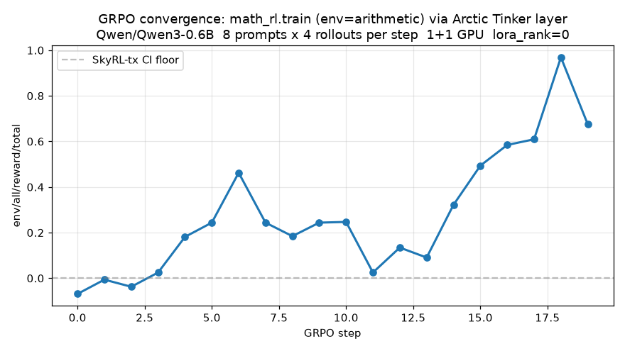

# Tinker HTTP layer for Arctic-Platform (v1)

Expose Arctic's RL server over the
[Tinker](https://github.com/thinking-machines-lab/tinker) HTTP
protocol so the upstream `tinker` Python client can drive Arctic.
[SkyRL-tx](https://github.com/NovaSky-AI/SkyRL/tree/main/skyrl) is a
reference open-source implementation of the same protocol.

Scope: **RL only**, colocated (`colocate=True`, CUDA-IPC weight
sync), single global training run, no auth. **Full-weight DeepSpeed
training via the SkyRL-tx `LoraConfig(rank=0)` = FFT convention** —
`rank>0` returns HTTP 400 in v1.

## Wire protocol summary (pinned against upstream `tinker` SDK)

All routes are `POST /api/v1/<verb>` with a strict Pydantic body,
except `client/config` (some newer SDKs GET it). Every
long-running verb (`forward`, `forward_backward`, `optim_step`,
`save_weights_for_sampler`, `asample`, `create_model`) returns a
**future**:

```json
{"request_id": "42", "status": "pending", "type": "future"}
```

Clients then poll `POST /api/v1/retrieve_future {request_id}`. In v1
we execute inline in the request handler and stash the result in an
in-memory `dict[request_id] -> response`, so retrieve_future returns
the completed result on first call.

## Metric naming

Tinker's `combine_fwd_bwd_output_results` requires every metric key
to encode its cross-actor reduction as `name:reduction` (`:mean`,
`:sum`, `:min`, `:max`, `:slack`, `:hash_unordered`, `:unique`).
Arctic handlers emit plain keys (`loss`, `grad_norm`, `kl`, ...), so
the Tinker router post-processes them via
`arctic_metrics_to_tinker(...)`: it drops non-numeric values and
appends `:mean` to any key that lacks a reduction suffix. `:mean` is
the safe default because it weights by per-actor sample count
(`len(loss_fn_outputs)`).

## Verb mapping

| Tinker route | Upstream body | Arctic handler | Notes |
| :--- | :--- | :--- | :--- |
| `/api/v1/create_session` | `CreateSessionRequest {tags, user_metadata, sdk_version}` | in-memory bookkeeping | returns `{session_id}` |
| `/api/v1/session_heartbeat` | `SessionHeartbeatRequest` | no-op | returns `{}` |
| `/api/v1/client/config` | `ClientConfigRequest {sdk_version}` | static response | force `proto_write_fwdbwd=false` (JSON path only in v1) |
| `/api/v1/auth/token` | `{}` | echo `{jwt: "tml-dummy"}` | no auth in v1 |
| `/api/v1/telemetry` | `TelemetrySendRequest` | no-op ack | drop events on the floor |
| `/api/v1/get_server_capabilities` | `{}` | static | one entry: the server's `base_model` |
| `/api/v1/create_model` | `CreateModelRequest {session_id, model_seq_id, base_model, lora_config, user_metadata}` | full-weight if `lora_config.rank==0`, else 400 | returns `{model_id, base_model, lora_config, status, request_id}` (future) |
| `/api/v1/get_info` | `GetInfoRequest {model_id, type}` | reads in-memory model | returns `{model_id, status, model_data}` |
| `/api/v1/create_sampling_session` | `CreateSamplingSessionRequest {session_id, sampling_session_seq_id, base_model?, model_path?}` | in-memory bookkeeping | returns `{sampling_session_id}` bound to a weight generation |
| `/api/v1/forward` | `ForwardRequest {forward_input, model_id, seq_id?}` | `fwd_bwd(..., forward_only=True)` | returns future; result carries per-token logprobs |
| `/api/v1/forward_backward` | `ForwardBackwardRequest {forward_backward_input, model_id, seq_id?}` | `fwd_bwd(...)` with `loss_fn_config` threaded into `actor_config` | returns future; result = `ForwardBackwardOutput` |
| `/api/v1/optim_step` | `OptimStepRequest {adam_params, model_id, seq_id?}` | `step(optim_overrides=...)` | returns future; result = `OptimStepResponse{metrics}` |
| `/api/v1/save_weights_for_sampler` | `SaveWeightsForSamplerRequest {model_id, path?, sampling_session_seq_id?, seq_id?, ttl_seconds?}` | `sync_weights(cuda_ipc=True)` + bump weight-gen | returns future; result = `SaveWeightsForSamplerResponse{path, sampling_session_id}` |
| `/api/v1/asample` | `SampleRequest {prompt, sampling_params, num_samples, base_model?, model_path?, sampling_session_id?, seq_id?, prompt_logprobs?, topk_prompt_logprobs?}` | `generate(...)` | returns future; result = `SampleResponse{sequences}` |
| `/api/v1/retrieve_future` | `FutureRetrieveRequest {request_id, allow_metadata_only}` | pop from in-memory store | polymorphic body: `TryAgainResponse` if not ready, else the terminal response |

Not implemented in v1 (return 501): `load_weights`, `unload_model`,
`weights_info`, `training_runs/*`. All are E1 extensions.
`save_weights` is ack-only in v1 (real state persistence is E2).

## Loss functions (v1)

`ForwardBackwardInput.loss_fn` is a
`Literal["cross_entropy","importance_sampling","ppo","cispo","dro"]`.
`loss_fn_config: Optional[Dict[str, float]]` is a free-form dict; the
built-in Tinker loss functions read specific keys from it.

| `loss_fn` | v1 status | Maps to |
| :--- | :--- | :--- |
| `ppo` | supported | Arctic `verl_grpo`; `clip_low_threshold`/`clip_high_threshold`/`kl_coef`/`entropy_coef` → `eps_clip`/`eps_clip_higher`/`kl_loss_coef`/`entropy_coeff` |
| `importance_sampling` | supported | Arctic PPO with both clip bounds disabled (unbounded IS ratio) |
| `cispo`, `dro` | HTTP 400 | not in Arctic — separate PR |
| `cross_entropy` | HTTP 400 | RL-only v1; SFT/CE out of scope. Blocks `forward_backward_custom`. |
| `forward_backward_custom` | — | Client-side SDK sugar; not a wire verb. Unblocks automatically once `cross_entropy` + `forward_only` land (E3). |

## Architecture

```
                   ┌──────────────────┐
   Tinker client   │                  │   Native client (verl, dev scripts)
   (HTTP + tinker  │                  │   (HTTP or Ray)
    Python SDK)    │                  │
        │          │                  │           │
        ▼          │                  │           ▼
  POST /api/v1/*   │                  │  POST /fwd-bwd, /step, ...
        │                                          │
        ▼                                          ▼
  ┌─────────────────────────────────────────────────────────┐
  │                FastAPI app (one process)                │
  │  ┌────────────────────────┐  ┌─────────────────────────┐│
  │  │  tinker_router.py      │  │  http_server.py         ││
  │  │  (NEW router)          │──▶  (native routes, unchg) ││
  │  │  · Datum → batch       │  │  · /fwd-bwd             ││
  │  │  · AdamParams → overr. │  │  · /step (+ overrides)  ││
  │  │  · SamplingParams → vL │  │  · /generate            ││
  │  │  · weight-gen counter  │  │  · /sync-weights        ││
  │  │  · future store        │  │                         ││
  │  └────────────────────────┘  └───────────┬─────────────┘│
  └──────────────────────────────────────────┼──────────────┘
                                             ▼
                            ┌────────────────────────────────┐
                            │  Ray placement group (colocated)│
                            │   ├─ DeepSpeed training workers │
                            │   ├─ vLLM engine (CUDA IPC ⇄ DS)│
                            │   └─ log-prob workers           │
                            └────────────────────────────────┘
```

Tinker router lowers into existing Arctic HTTP handlers via in-process
function calls, not a second HTTP hop.

## Futures model

Tinker's wire is future-based. v1 executes inline and stashes results
so `retrieve_future` returns the finished result on the first poll:

```python
# tinker_router.py
_FUTURE_STORE: dict[str, dict] = {}
_FUTURE_COUNTER = itertools.count()

def _new_request_id() -> str:
    return str(next(_FUTURE_COUNTER))

async def _submit(runner: Callable[[], Awaitable[dict]]) -> UntypedAPIFuture:
    request_id = _new_request_id()
    result = await runner()  # inline for v1; async task in E-async
    _FUTURE_STORE[request_id] = result
    return {"request_id": request_id, "status": "completed", "type": "future"}
```

`E-async` (below) upgrades `_submit` to `asyncio.create_task` +
`TryAgainResponse` polling.

## Sync vs async RL semantics

Tinker's `SamplingClient` is immutable and picklable, bound to a
`sampling_session_id` that identifies a weight snapshot. Cookbook
async-RL loops mint a new snapshot per training step and pass the
client to headless rollout workers; `importance_sampling` handles
off-policy correction between the sampler's stale weights and the
in-flight training policy.

Arctic's colocated CUDA-IPC path holds **one** weight version on the
sampler at a time — no on-GPU snapshot store. v1 adopts
**strict-monotonic** semantics:

```
sampling_session_id = f"ss@{gen}"    # gen = monotonic weight-sync counter
POST /api/v1/asample:
    if int(gen) <  app.state.tinker_weight_gen:  → TryAgainResponse (client will retry, then hit 409 on retrieve_future)
    if int(gen) == app.state.tinker_weight_gen:  → serve from current vLLM weights
```

This matches Tinker's synchronous RL recipes (train → save → sample →
train). True async-RL requires concurrent LoRA snapshots on vLLM and
is captured as **E1** below.

## RL step data flow

```
Client                Tinker route              Arctic handler       Compute
──────                ────────────              ──────────────       ───────
create_session       ─▶ /api/v1/create_session  ─▶ in-memory       ─▶ —
create_model         ─▶ /api/v1/create_model    ─▶ in-memory        ─▶ —
   (base_model,        (rank==0 → FFT)             (model_id)
    LoraConfig(0))

sample(prompt, n=16) ─▶ /api/v1/asample        ─▶ /generate         ─▶ vLLM
retrieve_future      ─▶                        ◀──  {results}       ◀── (rollouts,
                                                                          logprobs)

  [client computes rewards + advantages]

forward_backward     ─▶ /api/v1/forward_backward ─▶ /fwd-bwd        ─▶ DeepSpeed
  (data, "ppo",         (datum → batch,             ({"loss_fn":         (existing PPO
   loss_fn_config)       loss_fn_config              "ppo", ...},         path; clip
                         → actor_config)             actor_config          ratios from
                                                     updated)              loss_fn_config)
retrieve_future     ◀── {loss_fn_outputs, metrics}                   ◀──

optim_step           ─▶ /api/v1/optim_step    ─▶ /step             ─▶ DeepSpeed
  (AdamParams(lr=…))   (adam → overrides)      (overrides applied      optimizer
                                                to param_groups)
retrieve_future     ◀── {metrics}                                    ◀──

save_weights_for_    ─▶ /api/v1/save_weights_ ─▶ /sync-weights     ─▶ CUDA IPC
  sampler               for_sampler             (cuda_ipc=True,       (DS → vLLM)
                        (bump weight_gen)        colocate=True)
retrieve_future     ◀── {path, sampling_session_id}                  ◀──

[loop]

──────────────────────────────────────────────────────────────────────────
Per step: 4 wire calls (asample, forward_backward, optim_step,
save_weights_for_sampler) + their retrieve_future polls. Wire cost is
one HTTP round-trip more per verb than Arctic native today; those
polls are ~free in v1 (inline completion) and become real in E-async.
```

## Concrete changes (as-shipped)

Files touched at v1 completion (see `git diff main...HEAD`):

| File | Change |
| :--- | :--- |
| `arctic_platform/rl/deepspeed_worker.py` | `step()` gains `optim_overrides: dict \| None` (per-call Adam knobs from `AdamParams`). |
| `arctic_platform/rl/http_server.py` | `/step` accepts `StepRequest.optim_overrides`. New `POST /tinker/bind` endpoint wires two existing Arctic jobs (created via native `/initialize`) into the Tinker HTTP verbs on the same server. **No provisioning in the Tinker layer** — ZoRRo, ZeRO stage, offload, vLLM knobs, LR schedule are all set on the underlying jobs. |
| `arctic_platform/rl/ray_server.py` | Mirror `optim_overrides` on the Ray transport. |
| `arctic_platform/rl/utils/server_models.py` | `StepRequest.optim_overrides` field. |
| `arctic_platform/rl/tinker_router.py` | **new** — Pydantic wire models, `Datum → Arctic batch` adapter, `AdamParams → optim overrides`, `SamplingParams → vLLM`, `loss_fn_config → actor_config`, weight-gen counter, in-memory future store, FastAPI router mounted at `/api/v1/`. |
| `arctic_platform/rl/examples/tinker_smoke.py` | **new** — one-file E2E smoke: `tinker.ServiceClient()` → `create_lora_training_client(rank=0)` → sample + `forward_backward(loss_fn="ppo")` + `optim_step` loop. |
| `arctic_platform/rl/__init__.py` | PEP 562 lazy imports so `tinker_router` is importable in a CPU-only env (tests). |
| `tests/tinker_layer/*` | 76 tests: wire schema, adapters, in-process httpx round-trip per route, `tinker.ServiceClient` acceptance loop. |

Sketch of the deepspeed override (the smallest interesting hunk):

```python
# deepspeed_worker.py
def step(self, optim_overrides: dict | None = None) -> dict:
    if optim_overrides:
        for pg in self.engine.optimizer.param_groups:

            for k in ("lr", "betas", "eps", "weight_decay"):
                if k in optim_overrides:
                    pg[k] = optim_overrides[k]
    self.engine.step()
    ...
```

Everything else lives in `arctic_platform/rl/tinker_router.py`. The
authoritative wire schemas + router bodies are that file; what follows is
a schematic so a reviewer can eyeball the shape without paging through
1k lines of source.

### `arctic_platform/rl/tinker_router.py` sketch

Wire models are redefined locally as Pydantic v2 classes so the server has
no runtime dependency on the `tinker` package (schemas are regressed by
`tests/tinker_layer/test_wire_schema.py`):

- Datum plumbing: `TensorData`, `EncodedTextChunk`, `ModelInput`, `Datum`,
  `ForwardBackwardInput`/`Request`/`Output`.
- Training-side: `AdamParams`, `OptimStepRequest`/`Response`, `LoraConfig`,
  `CreateModelRequest`, `SaveWeightsRequest`/`Response`,
  `SaveWeightsForSamplerRequest`/`Response`.
- Sampling-side: `SamplingParams`, `SampleRequest`, `SampledSequence`,
  `SampleResponse`, `StopReason`.
- Futures: `UntypedAPIFuture`, `TryAgainResponse`.
- Housekeeping: session/heartbeat/client-config/telemetry/get-info/etc.

Adapters (all inline in `tinker_router.py`):

- `datum_list_to_arctic_batch(data, loss_fn, loss_fn_config, max_prompt_length,
  max_response_length, pad_token_id, forward_only)` — packs a `list[Datum]`
  into Arctic's fwd_bwd batch dict. Left-pad prompt + right-pad response,
  padded to `max_prompt_length + max_response_length` (ZoRRo invariant).
  Prompt/response boundary inferred per-Datum from the first non-zero
  position in `weights` / `mask` / `advantages` / `target_tokens`.
- `adam_params_to_optim_overrides(AdamParams)` → `{lr, betas, eps, weight_decay}`
  passed to `deepspeed_worker.step(optim_overrides=…)`.
- `sampling_params_tinker_to_vllm(SamplingParams, num_samples)` →
  vLLM-flavoured dict (`n`, `temperature`, `top_p`, `top_k`, `max_tokens`,
  `stop` / `stop_token_ids`, `seed`, `logprobs=1`).
- `_loss_fn_config_to_actor_config(loss_fn, cfg)` — maps tinker's
  `ppo` / `importance_sampling` clip / KL / entropy knobs to Arctic's
  `actor_config`.

Routes (all `POST /api/v1/<verb>`, all under `router`, wired via
`app.include_router(_tinker_router)` in `http_server.py`):

- Bootstrap: `create_session`, `session_heartbeat`, `client/config`,
  `auth/token`, `telemetry`, `get_server_capabilities`.
- Model lifecycle: `create_model` (LoRA rank>0 → 400), `get_info`.
- Training: `forward_backward`, `forward`, `optim_step`.
- Weight sync + sampling: `save_weights_for_sampler` (bumps weight-gen,
  triggers CUDA-IPC `sync_weights`), `save_weights` (ack-only state save,
  extension E2), `create_sampling_session`, `asample`
  (stale `sampling_session_id` → 409).
- Futures: `retrieve_future`.

The router is mounted eagerly at server start. In-process handlers are
wired lazily via `POST /tinker/bind`, which takes an already-provisioned
`training_job_id` + `sampling_job_id` (from Arctic's native `/initialize`).
This keeps Tinker a pure adapter: every ArcticRL optimization (ZoRRo,
ZeRO-3, offload, FCA, custom LR schedules) is available by turning it on
at `/initialize` time. See `recipes/rl/tinker/serve.sh` for a reference
provision → bind flow.

## E2E validation

### GRPO convergence — SkyRL-tx's canonical CI recipe

The single strongest parity claim: SkyRL-tx's own GPU-CI GRPO test
([`SkyRL/tests/train/gpu_e2e_test/gsm8k_tinker.sh`](https://github.com/NovaSky-AI/SkyRL/blob/main/tests/train/gpu_e2e_test/gsm8k_tinker.sh))
drives a running Tinker server with Thinking Machines' upstream
[`tinker_cookbook.recipes.math_rl.train`](https://github.com/thinking-machines-lab/tinker-cookbook)
recipe — group-relative advantages, no critic — and passes if reward
climbs above a floor. We swap SkyRL-tx's server for Arctic and get the
same shape:

```bash
python -m arctic_platform.rl.http_server \
    --host 0.0.0.0 --port 7000 --training-gpus 1 --sampling-gpus 1 --colocate

URL=http://localhost:7000 MODEL=Qwen/Qwen3-0.6B \
ENV=arithmetic GROUP_SIZE=4 GROUPS_PER_BATCH=8 MAX_TOKENS=64 MAX_STEPS=20 LR=1e-5 \
    recipes/rl/tinker/grpo_e2e.sh
```

Convergence (20 GRPO steps, 8 prompts × 4 rollouts per step, 1+1 GPU):



Reward per step: `-0.07, -0.01, -0.04, 0.03, 0.18, 0.24, 0.46, 0.24, 0.18, 0.24, 0.25, 0.03, 0.13, 0.09, 0.32, 0.49, 0.58, 0.61, 0.97, 0.68`

Reward climbs from ~0 to a peak of 0.97 — same qualitative shape as
SkyRL-tx's own CI run on the same recipe. Training exits with
`Training completed successfully`; final checkpoint (`state_path`,
`sampler_path`) is written via `save_state` / `save_weights_for_sampler`.

### SkyRL-tx integration tests, ported

`tests/tinker_layer/test_skyrl_tx_parity.py` runs the tests from
[`SkyRL/tests/tinker/test_api.py`](https://github.com/NovaSky-AI/SkyRL/blob/main/tests/tinker/test_api.py)
against Arctic through the real upstream `tinker` Python SDK. The
`arctic_server` fixture spawns `http_server`, drives `serve.sh` to
provision + bind, then yields the base URL:

| SkyRL-tx test | Status | Assertion |
| --- | --- | --- |
| `test_capabilities`                | pass | bound model appears in `get_server_capabilities` |
| `test_training_workflow_core`      | pass | `forward_backward` → `optim_step` round-trip, `loss_fn_outputs` shape matches per-Datum |
| `test_sample_base_model`           | pass | `SamplingParams` respects `max_tokens` / `num_samples` |
| `test_sample_top_k`                | pass | `top_k=1` deterministic, `top_k=-1` diverse |
| `test_sample_num_samples_diversity`| pass | `num_samples=k` with fixed seed → k diverse-but-reproducible sequences |

```
$ pytest tests/tinker_layer/test_skyrl_tx_parity.py -m gpu -v
5 passed in 65.83s
```

Edits from upstream:

- `LORA_RANK = 0` (v1 uses `LoraConfig(rank=0)` for full-weight training; `rank>0` → HTTP 400 in `/create_model`).
- `test_training_workflow_core` uses `importance_sampling` instead of `cross_entropy` (v1's supported-loss set is `{ppo, importance_sampling}`; SFT-style CE lives outside RL scope) and drops REST-only checkpoint-listing extras (`list_checkpoints`, `list_training_runs`).
- `test_sample_base_model` runs the base-model branch only (LoRA is E1).

### Arctic smoke

`arctic_platform/rl/examples/tinker_smoke.py` is a minimal 5-step
`sample → forward_backward → optim_step` loop against a running server;
useful as a first-signal probe before pointing the cookbook at Arctic.

## Tests

`tests/tinker_layer/` — CPU-only unit suite (no torch / vLLM / DeepSpeed):

```
tests/tinker_layer/
  test_wire_schema.py       # Pydantic models track upstream tinker
  test_adapters.py          # datum→batch (ZoRRo padding), loss_fn_config
                            # → actor_config, AdamParams / SamplingParams
  test_tinker_router.py     # in-process httpx round-trip per route
  test_tinker_bind.py       # POST /tinker/bind: verifies job IDs + wiring
  test_rl_loop.py           # real tinker.ServiceClient acceptance loop
  test_skyrl_tx_parity.py   # GPU parity tests ported from SkyRL-tx (marked)
```

```
$ python -m pytest tests/tinker_layer/ -m 'not gpu' -q
80 passed in 9.17s

$ python -m pytest tests/tinker_layer/ -m gpu -v
5 passed in 65.83s   # GPU-required; boots real server + Ray + vLLM
```

## Design notes (resolved during the schema spike)

1. **`create_lora_training_client` vs full-weight training.** We adopt
   SkyRL-tx's convention: `LoraConfig(rank=0)` = full-weight fine-tuning,
   `rank>0` → HTTP 400 in v1.
2. **`loss_fn_config` → Arctic `actor_config`.** `ppo` maps
   `clip_low_threshold`/`clip_high_threshold` (+ `kl_coef`, `entropy_coef`) to
   Arctic's `eps_clip`, `eps_clip_higher`, `kl_loss_coef`, `entropy_coeff`.
   `importance_sampling` disables clipping (bounds set to `1e12`).
   See `_loss_fn_config_to_actor_config` and the matching tests.
3. **Auth.** The SDK creates `ServiceClient()` without env vars; it hits
   `/api/v1/auth/token` and expects `{jwt: <string>}`. v1 returns
   `{jwt: "tml-dummy"}` unconditionally (E5 will replace this).
4. **`SamplingParams` / `SampleResponse` shape.** Wire schema pinned to
   `tinker.types._pydantic_types.sampling_params` and `sample_response`.
5. **`ModelInput` shape.** `chunks: list[EncodedTextChunk{type:"encoded_text",
   tokens: list[int]}]` (v1 is text-only; images/dmel → 400).
6. **Metric naming.** Every metric key that reaches the client must carry a
   `:reduction` suffix (`combine_fwd_bwd_output_results` splits on `:`). Plain
   Arctic keys are annotated with `:mean` in `arctic_metrics_to_tinker`.
7. **`ForwardBackwardOutput.loss_fn_outputs` doubles as the reduction weight.**
   Arctic returns one aggregated batch, so the adapter emits one empty
   `LossFnOutput` per input `Datum` to keep `len(loss_fn_outputs)` well-defined
   (avoids `np.average` `ZeroDivisionError`).
8. **Tests live in `tests/tinker_layer/`, not `tests/tinker/`.** Otherwise
   the local package shadows the upstream `tinker` SDK when `test_rl_loop.py`
   imports it.
9. **`arctic_platform.rl.__init__` uses PEP 562 lazy imports** so
   `tinker_router` is importable in a CPU-only env for the test suite (eager
   imports of `deepspeed_worker` pull in torch and break collection).

## Extensions (post-v1)

### E-async. Real async future execution

v1 executes inline. E-async wraps `_submit_future` with
`asyncio.create_task` and `TryAgainResponse` polling from
`retrieve_future`. This lets the client pipeline forward_backward +
save_weights_for_sampler + asample without serializing behind each
inline call.

### E1. Async-RL snapshot store

Enables Tinker's documented async-RL pattern: multiple live
`SamplingClient` snapshots serving in parallel with the training loop.

Requires:
- **Snapshot storage** — LoRA adapters on disk / blob, or full-weight
  `DeepSpeed.save_checkpoint` per snapshot.
- **vLLM adapter reload** — sampler picks the adapter/weights tagged
  by `sampling_session_id` per request (via vLLM's `LoRARequest`).
- **Off-policy correction** — client uses `importance_sampling` /
  `ppo` with `loss_fn_inputs.logprobs` set to the sampler's logprobs
  at rollout time (already the RL Datum shape).

v1 rejects async use with HTTP 409 on stale `sampling_session_id`;
E1 flips the semantics from strict-monotonic to versioned-snapshot.

### E2. State-save persistence

`/api/v1/save_weights` is ack-only in v1 (returns a synthetic
`tinker://main/state/{gen}` path so cookbook recipes that end with
`save_checkpoint(kind="both")` don't crash). E2 wires it through to
`DeepSpeed.save_checkpoint` + a matching `load_weights` endpoint so
runs can be resumed from a state path.

### E-rollouts. Server-side rollout retention

`asample` returns a `rollout_id` and caches tokens/logprobs
server-side. `forward_backward(rollout_id, advantages_only=…)` accepts
just the id + advantages. Non-standard extension via optional field.
Wire savings: 1 rollout crosses the wire per step instead of 2.

### E3. SFT + `forward_backward_custom`

Wire up `cross_entropy` as a named loss (plus `forward_only`
end-to-end). Once both land, the upstream `tinker` SDK's
client-side `forward_backward_custom` works against Arctic with no
new server endpoint.

### E4. Non-colocated snapshot backend

NCCL broadcast or blob store for cross-node weight sync. Config knob:
`snapshot_backend=cuda_ipc | nccl | blob`.

### E5. Auth

Real bearer-token middleware; drop the `tml-dummy` special-case.

### E6. Fused RL-step endpoint

`POST /api/v1/rl_step {prompts, reward_fn, adam_params}` — one
round-trip per step. Breaks pure Tinker shape but cuts most of the
wire hops.

